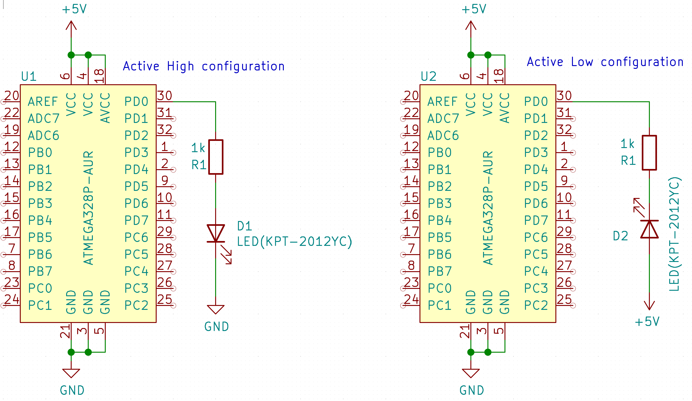
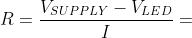
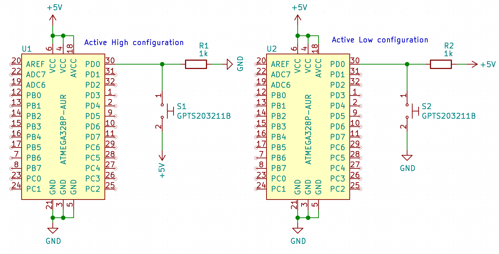

# Lab 2 : Zuzana Czmelová

Link to your `Digital-electronics-2` GitHub repository:

   [https://github.com/Zuzanaczm/Digital_electronics_2/tree/main/Labs/02-Leds](https://github.com/Zuzanaczm/Digital_electronics_2/tree/main/Labs/02-Leds)

### Part 1 - Preparation tasks 

1. Draw two basic ways to connect a LED to the output pin of the microcontroller: LED active-low, LED active-high.



2. [Calculate LED resistor value](https://electronicsclub.info/leds.htm) for typical red and blue LEDs.




| **LED color** | **Supply voltage** | **LED current** | **LED voltage** | **Resistor value** |
| :-: | :-: | :-: | :-: | :-: |
| red | 5&nbsp;V | 20&nbsp;mA | 2V | 150 ohm |
| blue | 5&nbsp;V | 20&nbsp;mA | 4V | 50 ohm |

```LaTeX
R = \frac{V_{SUPPLY}-V_{LED}}{I} =
```

3. Draw the basic ways to connect a push button to the microcontroller input pin: button active-low, button active-high.




### Part 2 - Active-low and active-high LEDs

1. Complete tables according to the AVR manual.

| **DDRB** | **Description** |
| :-: | :-- |
| 0 | input pin |
| 1 | output pin |

| **PORTB** | **Description** |
| :-: | :-- |
| 0 | output low value |
| 1 | output high value |

| **DDRB** | **PORTB** | **Direction** | **Internal pull-up resistor** | **Description** |
| :-: | :-: | :-: | :-: | :-- |
| 0 | 0 | input | no | Tri-state, high-impedance |
| 0 | 1 | input | yes | Pxn will source current if ext. pulled low|
| 1 | 0 | output| no | output Low (Sink)|
| 1 | 1 | output | no | Ootput High (Source)|


| **Port** | **Pin** | **Input/output usage?** |
| :-: | :-: | :-- |
| A | x | Microcontroller ATmega328P does not contain port A |
| B | 0 |  Arduino pin D8 |
|   | 1 |  Arduino pin D9 |
|   | 2 |  Arduino pin D10 |
|   | 3 |  Arduino pin D11 |
|   | 4 |  Arduino pin D12 |
|   | 5 |  Arduino pin D13 |
|   | 6 | No |
|   | 7 | No |
| C | 0 | Arduino pin A0(D14) |
|   | 1 |  Arduino pin A1(D15) |
|   | 2 |  Arduino pin A2(D16) |
|   | 3 |  Arduino pin A3(D17) |
|   | 4 | Arduino pin A4(D18)|
|   | 5 |  Arduino pin A5(D19) |
|   | 6 | Yes/Reset |
|   | 7 | No |
| D | 0 |  Arduino pin RX<-D0 |
|   | 1 |  Arduino pin TX<-D1 |
|   | 2 |  Arduino pin D2 |
|   | 3 | Arduino pin D3 |
|   | 4 | Arduino pin D4 |
|   | 5 |  Arduino pin D5 |
|   | 6 |  Arduino pin D6 |
|   | 7 |  Arduino pin D7 |

2. Part of the C code listing with syntax highlighting, which blinks alternately with a pair of LEDs; let one LED is connected to port B and the other to port C:

```c
#define LED_GREEN   PB5     // AVR pin where green LED is connected
#define LED_RED     PC5
#define BLINK_DELAY 500

int main(void)
{
    DDRB = DDRB | (1<<LED_GREEN);
    // ...and turn LED off in Data Register
    PORTB = PORTB & ~(1<<LED_GREEN);

    // Configure the second LED at port C
    DDRC =  DDRC | (1<<LED_RED);
    PORTC = PORTC | (1<<LED_RED);

    // Infinite loop
    while (1)
    {
        // Pause several milliseconds
        _delay_ms(BLINK_DELAY);

	PORTB = PORTB ^ (1<<LED_GREEN);
        PORTC = PORTC ^ (1<<LED_RED);
    }

    // Will never reach this
    return 0;
}
```

### Part 3 - Push button 
```c
int main(void)
{
    // Green LED at port B
    // Set pin as output in Data Direction Register...
   DDRB = DDRB | (1<<LED_GREEN);                //output
    // ...and turn LED off in Data Register
   PORTB = PORTB & ~(1<<LED_GREEN);

    // Configure the second LED at port C
   DDRC  = DDRC  | (1<<LED_RED);                                    //output
   PORTC = PORTC & ~(1<<LED_RED);

    // Configure Push button at port D and enable internal pull-up resistor
   DDRD  =  DDRD & ~(1<<BUTTON);
   PORTD =  PORTD | (1<<BUTTON);

    // Infinite loop
    while (1)
    {
        if (((PIND>>BUTTON) & 1) == 0)
	  
        _delay_ms(BLINK_DELAY); 
        PORTB = PORTB ^ (1<<LED_GREEN);   
        PORTC = PORTC ^ (1<<LED_RED); 
    }

    // Will never reach this
    return 0;
}
```
