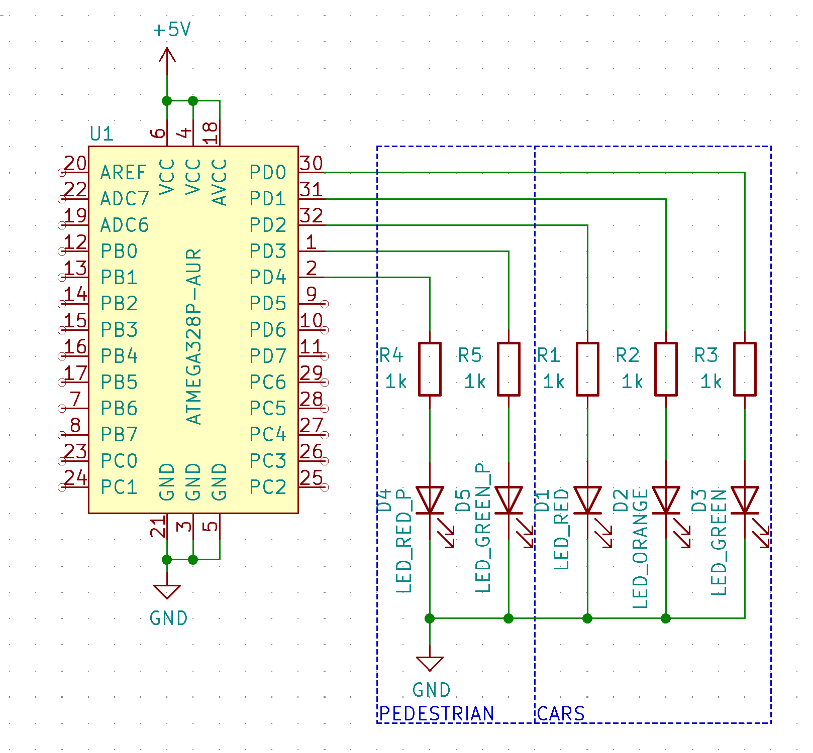

# Lab 3 : Zuzana Czmelová

Link to your `Digital-electronics-2` GitHub repository:

   [https://github.com/Zuzanaczm/Digital_electronics_2/tree/main/Labs/03-gpio](https://github.com/Zuzanaczm/Digital_electronics_2/tree/main/Labs/03-gpio)

## Preparation tasks (done before the lab at home)

1. Fill in the following table and enter the number of bits and numeric range for the selected data types defined by C.

| **Data type** | **Number of bits** | **Range** | **Description** |
| :-: | :-: | :-: | :-- | 
| `uint8_t`  | 8 | 0, 1, ..., 255 | Unsigned 8-bit integer |
| `int8_t`   | 8 | -128, -127 ... 127 | Signed 8-bit Integer |
| `uint16_t` | 16 | 0, 1, ..., 65535 | Unsigned 16-bit integer |
| `int16_t`  | 16 | −32768, −32767, ... 32767 | Signed 16-bit integer |
| `float`    | 32 | -3.4e+38, ..., 3.4e+38 | Single-precision floating-point |
| `void`     | 0 | 0 | No return type for function / empty data type |


## GPIO library

1. In your words, describe the difference between the declaration and the definition of the function in C.
   * Function declaration - tells the compiler about a function's name, return type and parameters.
   * Function definition - provides the actual body of the function

2. Part of the C code listing with syntax highlighting, which toggles LEDs only if push button is pressed. Otherwise, the value of the LEDs does not change. Use function from your GPIO library. Let the push button is connected to port D:

```c
int main(void)
{
    // Green LED at port B
    GPIO_config_output(&DDRB, LED_GREEN);
    GPIO_write_low(&PORTB, LED_GREEN);

    // Configure the second LED at port C
    GPIO_config_output(&DDRC, LED_RED);
    GPIO_write_high(&PORTC, LED_RED);

    // Configure Push button at port D and enable internal pull-up resistor
    GPIO_config_input_pullup(&DDRD, BUTTON);
    

    // Infinite loop
    while (1)
    {
        // Pause several milliseconds
        _delay_ms(BLINK_DELAY);

         if((bit_is_clear(&PIND, BUTTON))
         {
	         GPIO_toggle(&PORTB, LED_GREEN);
	         GPIO_toggle(&PORTC, LED_RED);
	         loop_until_bit_is_set(&PIND, BUTTON);
         }
    }

    // Will never reach this
    return 0;
}
```

## Traffic light

1. Scheme of traffic light application with one red/yellow/green light for cars and one red/green light for pedestrians. Connect AVR device, LEDs, resistors, one push button (for pedestrians), and supply voltage. The image can be drawn on a computer or by hand. Always name all components and their values!

   
