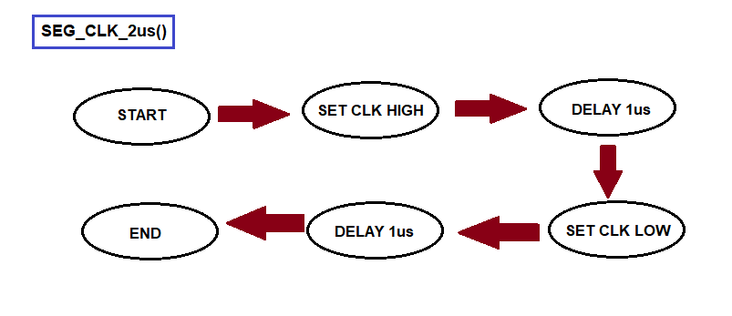

# Lab 5 : Zuzana Czmelová

Link to your `Digital-electronics-2` GitHub repository:

 [https://github.com/Zuzanaczm/Digital_electronics_2/tree/main/Labs/05-segment](https://github.com/Zuzanaczm/Digital_electronics_2/tree/main/Labs/05-segment)


## Preparation tasks

In the following table, write the binary values of the segments for display 0 to 9 on a common anode 7-segment display.

   | **Digit** | **A** | **B** | **C** | **D** | **E** | **F** | **G** | **DP** |
   | :-: | :-: | :-: | :-: | :-: | :-: | :-: | :-: | :-: |
   | 0 | 0 | 0 | 0 | 0 | 0 | 0 | 1 | 1 |
   | 1 | 1 | 0 | 0 | 1 | 1 | 1 | 1 | 1 |
   | 2 | 0 | 0 | 1 | 0 | 0 | 1 | 0 | 1 |
   | 3 | 0 | 0 | 0 | 0 | 1 | 1 | 0 | 1 |
   | 4 | 1 | 0 | 0 | 1 | 1 | 0 | 0 | 1 |
   | 5 | 0 | 1 | 0 | 0 | 1 | 0 | 0 | 1 |
   | 6 | 0 | 1 | 0 | 0 | 0 | 0 | 0 | 1 |
   | 7 | 0 | 0 | 0 | 1 | 1 | 1 | 1 | 1 |
   | 8 | 0 | 0 | 0 | 0 | 0 | 0 | 0 | 1 |
   | 9 | 0 | 0 | 0 | 1 | 1 | 0 | 0 | 1 |


### 7-segment library

1. In your words, describe the difference between Common Cathode and Common Anode 7-segment display.
   * CC SSD - common catode means that the cathodes o are connected to a single pin (to the ground) , display is selected by aplying negative voltage at anode and segments are selected by aplying positive  voltage at ports (=> logic 1 to a particular pin)
   * CA SSD - common anode means that the anode  side of all of the LEDs are  connected at one pin, and each LED cathode has its own pin , display is selected by aplying positive voltage at anode and segments are selected by aplying negative voltage at ports 

2. Code listing with syntax highlighting of two interrupt service routines (`TIMER1_OVF_vect`, `TIMER0_OVF_vect`) from counter application with at least two digits, ie. values from 00 to 59:

```c
ISR(TIMER1_OVF_vect)
{
    if(counter <= 59)
    {
    counter++;    
    digit1 = counter / 10;
    digit0 = counter % 10;
    }
    
    else
    {
    counter = 0;
    }
}

}
```

```c
ISR(TIMER0_OVF_vect)
{
    static uint8_t pos = 0;
        if (pos == 0)
        {
            SEG_update_shift_regs(digit1, 1);
            pos++;
        }
        else
        { 
            SEG_update_shift_regs(digit0, 0);
            pos = 0;      
        }
       
}

```

3. Flowchart figure for function `SEG_clk_2us()` which generates one clock period on `SEG_CLK` pin with a duration of 2&nbsp;us. The image can be drawn on a computer or by hand. Use clear descriptions of the individual steps of the algorithms.

   


